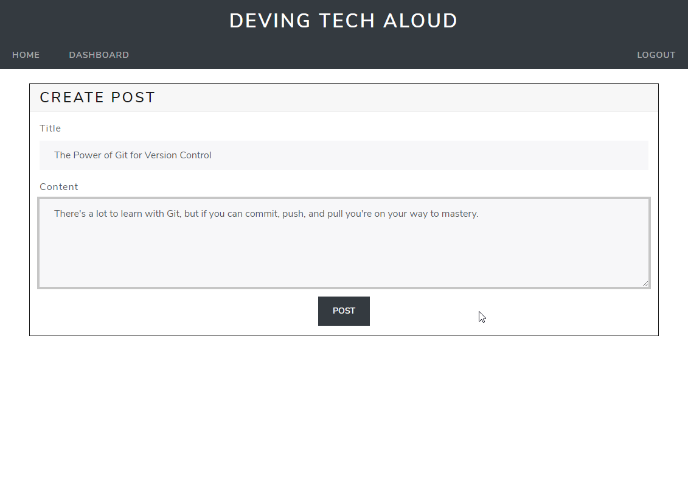

# Tech Blog - CMS
 &emsp;&emsp;

&nbsp;
## **Table of Contents**
  - [**Description**](#description)
  - [**Live Application**](#live-application)
  - [**Application Screenshots and Demo**](#application-screenshots-and-demo)
  - [**Technologies and Services**](#technologies-and-services)
  - [**License**](#license)

&nbsp;
## **Description**
Tech Blog provides a content management system (CMS) to run a blog site. Users can log in to publish a post on the site and leave comments on posts. Users have the ability to edit or delete previous posts from their dashboard. Non-logged in users can freely view published posts, but need to sign up to publish posts or leave comments.  

Tech Blog CMS is a full stack web application built following the Model View Controller (MVC) design paradigm. It uses MySQL and Sequelize for model definition and interaction, handlebars.js as the HTML view templating engine, and express.js for the server. The site uses cookies and session data to restrict access to publishing posts and comments to logged in users. 

The web application is hosted on Heroku for demonstration.

&nbsp;
## **[Live Application](https://spf-tech-blog.herokuapp.com/)**
## **Application Screenshots and Demo**

&nbsp;
## **Technologies and Services**
Development Technologies
- MySQL, Sequelize
- HTML, CSS, JavaScript, Handlebars.js
- Node.js, Express.js

External Frameworks, Services, and Credits
- [Bootstrap 5](https://getbootstrap.com/)
- [Bootswatch Lux Theme](https://bootswatch.com/lux/) bootstrap theme
- Favicon <a href="https://icons8.com/icons/set/developer">developer icon</a> from <a href="https://icons8.com/">Icons8</a>

&nbsp;
## **License**
Licensed under the [MIT](./LICENSE) license.